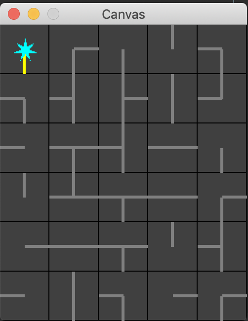

# LightEmAll

The goal of this game is to light up every tile on the board. This must be done by not only rotating every tile to connect accross the whole board, but also move the energy source (star) to the location where it can reach all tiles. 
When starting the game, all tiles are randomly rotated in place.

# Program information

Boards can be made to any specification while keeping the integrity of the board's pattern structure.
This project uses both Kruskal's algorithm of minimum spanning tree and Dijkstra's algorithm of shortest path to establish sizes for energetic radius, light path, and other optimizations. 

Clicking on any tile changes its orientation, possibly connecting it to a neighboring tile. 

There is more to the puzzle than connecting the whole board together via wires; the energy source must also be in the optimal position to energetically reach down all wires. The energy source can be controlled via arrow keys and can only move along the path created by the wiring. 

The player wins when all tiles are lit up on the board.

# Installation

To get LightEmAll up and running, both the code and the provided JARS must be downloaded. In your IDE of choice, import all three code files, and make sure both JARS are included in the reference libraries. To play the game, run the ExamplesLightWorld class, a window should appear and the game should function as described above.
